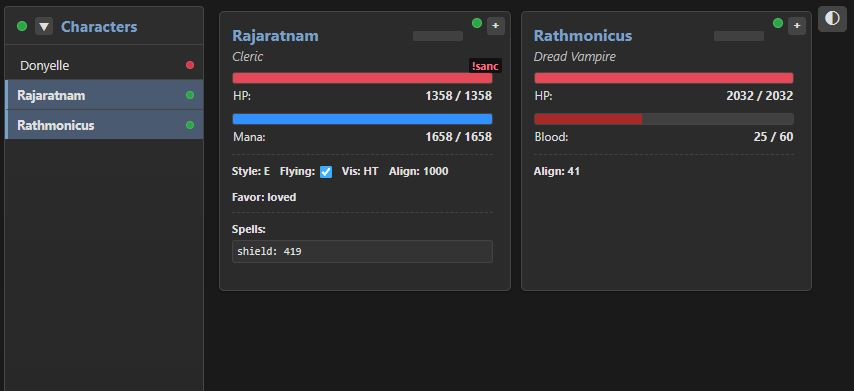

# MSDP Data Relay & Web Viewer

This project provides a system to relay data from MUD (Multi-User Dungeon) clients like ZMud and Tintin++ to a backend server, which then broadcasts this data to a real-time web-based character viewer. Compatible with any client that can send a http POST request.



## Overview

Players often use MUD clients with scripting capabilities to enhance their gameplay. This system allows these clients to send character status, combat information, and other relevant game data to a central server. The server processes this data and makes it available via a WebSocket connection to a web interface, allowing users (or perhaps party members, GMs, etc.) to view character information in a rich, graphical format in their web browser.

The core data transmission format from the MUD client to the server is a simple string of concatenated key-value pairs: `{key}{value}{key}{value}...`.

Two backend server implementations are provided:
1.  **Python Server**: Built with `aiohttp` for asynchronous handling. Recommended for personal or light use.
2.  **Rust Server**: Built with `axum` for performance and type safety. Recommended when performance matters (many users).

You only need to run **one** of these server implementations. Both servers are configurable via environment variables.

## Features

*   **Data Collection**: Scripts provided for ZMud and Tintin++ to send data.
*   **Flexible Data Format**: Simple `{key}{value}` string format for easy integration.
*   **Dual Server Implementations**:
    *   Python server for ease of development and common Python ecosystems.
    *   Rust server for high performance and robustness.
*   **Configurable Servers**: Key server parameters (host, port, timeouts, logging) can be set using environment variables or a `.env` file.
*   **Real-time Web Viewer**:
    *   Displays character cards with stats (HP, Mana/Blood), class, lag, opponent info, affects, and more.
    *   Supports multiple character cards (configurable up to 16 by default).
    *   Dynamic updates via WebSockets.
    *   Collapsible character list panel.
    *   Expandable cards to show full raw data.
    *   Light and Dark theme support.
    *   Responsive design for desktop and mobile.
    *   Connection status indicators.
*   **Data Management**: Servers handle data pruning for inactive characters and connection timeouts.

## Architecture
```
+--------------+ HTTP POST ({key}{value}...)+-----------------+  WebSocket (JSON)    +----------------+
| MUD Client   | -------------------------> | Backend Server  | ----------------->   | Web Viewer     |
| (ZMud/Tintin)|                            | (Python or Rust)|                      | (Browser)      |
+--------------+                            +-----------------+                      +----------------+
```

1.  **MUD Client**: The player's MUD client (ZMud or Tintin++) runs a script
    that collects game data.
2.  **Data Transmission**: The script periodically sends this data as a
    `{key}{value}` string via an HTTP POST request to the chosen backend
    server's `/update` endpoint.
3.  **Backend Server**:
    *   Receives the data string on its `/update` endpoint.
    *   Parses the string into a structured format (key-value map).
    *   Stores the character data and timestamps it.
    *   Manages data for multiple characters.
    *   Handles pruning of old data and client connection status based on
        configurable timeouts.
    *   Broadcasts updates (full state on new connection, deltas thereafter)
        as JSON over a WebSocket connection from its `/ws` endpoint.
    *   Serves the web viewer HTML page from its root (`/`) endpoint.
4.  **Web Viewer**:
    *   A static HTML page (`subscriber_client.html`) with JavaScript.
    *   Connects to the server's WebSocket endpoint.
    *   Receives JSON data and dynamically renders character cards.

    ## Server Configuration (Environment Variables)

Both Python and Rust servers can be configured using environment variables. You
can set these variables directly in your shell or by creating a `.env` file in
the respective server's root directory (`python_server/.env` or
`rust_server/.env`). The servers will automatically load variables from this
file if it exists.

**Example `.env` file:**
```dotenv
# Common for both servers (use appropriate variable name)
# For Python: SERVER_HOST=0.0.0.0
# For Rust:   HTTP_HOST=0.0.0.0
HTTP_PORT=8081
LOG_LEVEL=DEBUG

# Server-specific or common behavior control
PRUNE_INTERVAL_SECONDS=120
DATA_TIMEOUT_MINUTES=60
BROADCAST_INTERVAL_SECONDS=0.1
CONNECTION_TIMEOUT_SECONDS=10

# Rust specific
STATIC_DIR_PATH=./custom_static_path

## Components

### 1. MUD Clients

You'll need to install the appropriate script in your MUD client.

**Important:** The client scripts default to sending data to
`http://localhost:8080/update`. If you configure your server to use a
different host or port, you **must** update the URL in the client script.

#### a. ZMud Client

*   **File**: `zmud_client.txt`
*   **Setup**:
    1.  Open ZMud.
    2.  Copy the **entire content** of `zmud_client.txt`.
    3.  Paste it directly into the ZMud command input line and press Enter. This
        will import all the necessary aliases, variables, and triggers into a
        ZMud class named "server".
    4.  You will need to modify the prompt trigger to capture your own prompt AND fprompt (you may need 2 triggers).
    5.  **Modify URL if needed:** The script sends data to
        `http://localhost:8080/update`. If your server runs elsewhere, edit the
        URL in the `#ALIAS sendData` line.
    6.  If you do not use autologin, you will need to change {CHARACTER_NAME}{%char} to {CHARACTER_NAME}{myCharacter}
*   **Functionality**:
    *   Defines an alias `buildData` to construct the `{key}{value}` payload.
    *   Automatically sends data on prompt updates if data has changed.
    *   Includes a spell/affect duration tracking system.

#### b. Tintin++ Client

*   **File**: `tintin_client.txt`
*   **Setup**:
    1.  Copy the content of `tintin_client.txt`.
    2.  Add this script to your existing Tintin++ script file or create a new one.
    3.  **Modify URL if needed:** The script sends data to
        `http://localhost:8080/update` using `curl`. If your server runs
        elsewhere, edit this URL.
    4.  Ensure `curl` is installed and accessible in your system's PATH.
*   **Functionality**:
    *   Uses a `#ticker` to periodically send the content of the `$msdp_info`
        variable.
    *   Ensure your Tintin++ setup populates `$msdp_info`.
    *   Default update interval is `0.5` seconds (configurable via
        `#VAR update_interval`).

#### a. MUSH Client
    * Not yet implemented. Similar to TinTin++

### 2. Backend Servers (Choose ONE)

#### a. Python Server

*   **Location**: `python_server/`
*   **Main File**: `server.py`
*   **Requirements**:
    *   Python 3.7+
    *   `aiohttp`
    *   `orjson`
    *   `python-dotenv` (for `.env` file support)
    *   Install dependencies:
        ```bash
        cd python_server
        pip install -r requirements.txt
        ```
*   **Running**:
    Navigate to the `python_server` directory.
    ```bash
    python server.py
    ```
    The server will start, respecting environment variables (e.g., from
    `python_server/.env` or set in the shell). By default (if `SERVER_HOST` is
    `localhost`), it listens on `http://localhost:SERVER_PORT`.

#### b. Rust Server

*   **Location**: `rust_server/`
*   **Main File**: `src/main.rs`
*   **Requirements**:
    *   Rust toolchain (latest stable recommended). Install from
        [rustup.rs](https://rustup.rs/).
*   **Building & Running**:
    Navigate to the `rust_server` directory.
    1.  **Build**:
        ```bash
        cargo build --release
        ```
    2.  **Run**:
        ```bash
        cargo run --release
        ```
        Alternatively, after building, run the executable directly from the
        `rust_server` directory:
        ```bash
        ./target/release/rust_data_server # (or rust_msdp_server if that's the package name)
        ```
    The server will start, respecting environment variables (e.g., from
    `rust_server/.env` or set in the shell). By default (if `HTTP_HOST` is
    `0.0.0.0`), it listens on `http://0.0.0.0:HTTP_PORT` (accessible via
    `http://localhost:HTTP_PORT` or your machine's local IP address).

### 3. Web Viewer

*   **File Location**:
    *   For Python server: `python_server/static/subscriber_client.html`
    *   For Rust server: Expected in `static/subscriber_client.html` relative
        to where the Rust server is run (or the path specified by
        `STATIC_DIR_PATH`). By default, this is
        `rust_server/static/subscriber_client.html` if run from the
        `rust_server` directory.
*   **Access**:
    Once a backend server is running, open your web browser and go to
    `http://<configured_server_host>:<configured_server_port>/`.
    For example, if using defaults: `http://localhost:8080/`.
*   **Configuration**:
    *   The web viewer connects to `ws://<SERVER_HOST>:<SERVER_PORT>/ws`.
    *   If you change the server's host or port from the defaults
        (`localhost:8080`), you **must** update the `SERVER_HOST` and
        `SERVER_PORT` JavaScript constants at the top of the `<script>`
        section in `subscriber_client.html`.
*   **Features**:
    *   Dynamic character cards, theme toggle, collapsible list, expandable
        cards, status indicators, responsive layout.

## Data Flow & Format

### MUD Client to Server (HTTP POST)

MUD clients send data as plain text to `/update`. Format:
`{key1}{value1}{key2}{value2}...`
**Example:** `{CHARACTER_NAME}{MyChar}{HEALTH}{100}{HEALTH_MAX}{120}`
`CHARACTER_NAME` is crucial.

### Server to Web Viewer (WebSocket)

Server sends JSON to `/ws`.

1.  **Initial Snapshot**:
    ```json
    {
      "MyChar1": { "HEALTH": 100, "CLASS": "Warrior", ... },
      "MyChar2": { "HEALTH": 80, "CLASS": "Mage", ... }
    }
    ```

2.  **Delta Updates**:
    ```json
    {
      "updates": {
        "MyChar1": { "HEALTH": 95, ... }
      },
      "deletions": ["MyChar3"]
    }
    ```
## Rate Limiting (Rust Server Only)

The Rust server implements a rate limiting mechanism to protect the `/update` HTTP endpoint from abuse and ensure fair usage. It uses a token bucket algorithm applied on a per-IP address basis.

### How it Works

For each unique IP address making requests to the `/update` endpoint, the server maintains a "bucket" of tokens.

1.  **Token Refill**: Tokens are added to each IP's bucket at a constant rate, defined by `RATE_LIMIT_RPS` (Requests Per Second).
2.  **Burst Capacity**: Each bucket has a maximum capacity, defined by `RATE_LIMIT_BURST_CAPACITY`. This allows clients to make a burst of requests exceeding the `RPS` for a short period, as long as they have accumulated enough tokens.
3.  **Request Handling**:
    *   When a request arrives from an IP, the server first checks if the IP is currently banned. If so, a `403 Forbidden` status is returned.
    *   If not banned, the server attempts to consume one token from the IP's bucket.
    *   **Allowed**: If a token is available, it's consumed, the request is processed, and the IP's violation counter (see below) is decremented (if it was above zero).
    *   **Throttled**: If no token is available, the request is throttled, and a `429 Too Many Requests` status is returned. The IP's violation counter is incremented.
4.  **Violation Tracking and Banning**:
    *   Each time an IP is throttled (i.e., makes a request without sufficient tokens), its violation counter increases.
    *   If an IP accumulates `RATE_LIMIT_VIOLATION_THRESHOLD` violations, it is banned for a duration specified by `RATE_LIMIT_BAN_DURATION_SECONDS`.
    *   During a ban, all requests from that IP to `/update` will receive a `403 Forbidden` status.
    *   Once a ban expires, the IP can make requests again, and its violation counter is reset.
    *   Successfully processed requests (when a token is available) will gradually decrease the violation counter, allowing well-behaved clients to recover from accidental minor bursts.
5.  **State Cleanup**: To manage memory, the server periodically cleans up internal state for IP addresses that have been inactive for an extended period and are not currently banned, as configured by `RATE_LIMIT_CLEANUP_INTERVAL_SECONDS`.

### Configuration

The rate limiting behavior is controlled by the following environment variables:

*   `RATE_LIMIT_RPS` (float, e.g., `5.0`):
    The number of requests per second an IP is allowed on average. This is the rate at which tokens are refilled.
*   `RATE_LIMIT_BURST_CAPACITY` (float, e.g., `15.0`):
    The maximum number of tokens an IP's bucket can hold. This allows for short bursts. For example, with RPS=5 and Burst=15, an IP can make 15 requests quickly before being throttled to 5 RPS.
*   `RATE_LIMIT_VIOLATION_THRESHOLD` (integer, e.g., `20`):
    The number of throttled requests (violations) an IP can make before being banned.
*   `RATE_LIMIT_BAN_DURATION_SECONDS` (integer, e.g., `300`):
    The duration (in seconds) for which an IP is banned after exceeding the violation threshold. (e.g., 300 = 5 minutes).
*   `RATE_LIMIT_CLEANUP_INTERVAL_SECONDS` (integer, e.g., `600`):
    How often (in seconds) the server cleans up stale IP address entries from its rate-limiting state to conserve memory. (e.g., 600 = 10 minutes).

These variables should be set in your `.env` file or your deployment environment.

### Example Scenario

*   `RATE_LIMIT_RPS=2.0`
*   `RATE_LIMIT_BURST_CAPACITY=10.0`

An IP starts with 10 tokens.
*   It can immediately send 10 requests to `/update`.
*   After this burst, its token bucket is empty.
*   It must now wait for tokens to refill. Tokens are refilled at 2 per second.
*   If it tries to send a request when the bucket is empty, it gets a `429 Too Many Requests` and its violation counter increases.
*   If it continues to send requests while throttled and hits the `RATE_LIMIT_VIOLATION_THRESHOLD`, it will be banned.

    ## General Configuration Notes

*   **Server Address Consistency**: Ensure the MUD client scripts, the web
    viewer's JavaScript constants, and the server's actual listening address
    (configured via environment variables) all match.
*   **Firewall**: If accessing the server from other machines on your network
    (when host is `0.0.0.0`), ensure your firewall allows connections to the
    configured port.

